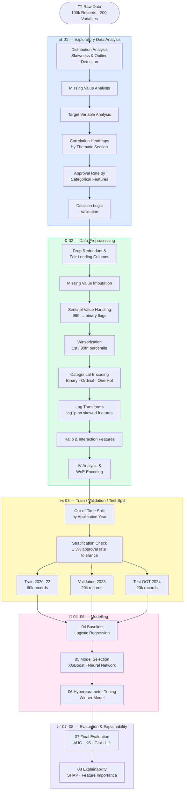
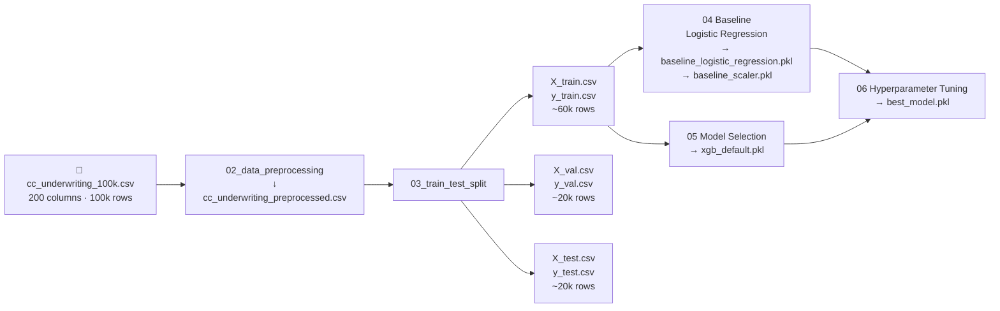

# Credit Card Underwriting — ML Pipeline

> A full end-to-end machine learning pipeline for predicting credit card application approval using 100,000 synthetic US consumer banking records across 200 variables.


---

## Table of Contents

- [Business Problem](#business-problem)
- [Dataset](#dataset)
- [ML Pipeline](#ml-pipeline)
- [Project Structure](#project-structure)
- [Notebooks](#notebooks)
- [Data Flow](#data-flow)
- [Models](#models)
- [Train / Validation / Test Split](#train--validation--test-split)
- [Approval Decision Logic](#approval-decision-logic)
- [Fair Lending Compliance](#fair-lending-compliance)
- [Installation](#installation)
- [Usage](#usage)

---

## Business Problem

**Decide whether to approve or decline a credit card application for a given applicant.**

| Target Variable | Type | Distribution |
|---|---|---|
| `target_approved` | Binary (Yes / No) | ~65% approved / ~35% declined |
| `target_credit_limit_assigned` | Discrete ($0 – $50,000) | Secondary target, out of scope |

The model must be explainable, fair-lending compliant, and robust to temporal drift across economic cycles.

---

## Dataset

| Attribute | Value |
|---|---|
| Records | 100,000 |
| Features | 200 variables across 11 thematic sections |
| Date Range | January 2020 – December 2024 |
| Geography | All 50 US States |
| FICO Score Range | 300 – 850 |
| Annual Income Range | $0 – $500,000 |
| Source | Synthetic — calibrated to US consumer credit norms |
| Seed | NumPy seed = 42 (fully reproducible) |

### Variable Sections

```
┌─────────────────────────────────────────────────────────────┐
│  Section 1   Applicant Demographics        (17 variables)   │
│  Section 2   Income & Financial Profile    (20 variables)   │
│  Section 3   Credit Bureau Profile         (30 variables)   │
│  Section 4   Banking Relationship          (15 variables)   │
│  Section 5   Application Details           (16 variables)   │
│  Section 6   Risk & Fraud Indicators       (18 variables)   │
│  Section 7   Bureau Tradeline Details      (20 variables)   │
│  Section 8   Behavioural & Lifestyle       (15 variables)   │
│  Section 9   Economic Context              ( 8 variables)   │
│  Section 10  Engineered & Model Features   (20 variables)   │
│  Section 11  Supplemental Contact/Channel  (20 variables)   │
│  ─────────────────────────────────────────────────────────  │
│  Targets     target_approved, target_credit_limit_assigned  │
└─────────────────────────────────────────────────────────────┘
```

---

## ML Pipeline



---

## Project Structure

```
credit-card-underwriting/
│
├── 📂 data/
│   ├── raw/                        ← original immutable source data
│   ├── processed/                  ← cleaned data, train/val/test splits
│   └── external/                   ← data dictionary PDF
│
├── 📂 notebooks/
│   ├── 01_exploratory_data_analysis.ipynb
│   ├── 02_data_preprocessing.ipynb
│   ├── 03_train_test_split.ipynb
│   ├── 04_baseline_model.ipynb
│   ├── 05_model_selection.ipynb
│   ├── 06_hyperparameter_tuning.ipynb
│   ├── 07_model_evaluation.ipynb
│   └── 08_model_explainability.ipynb
│
├── 📂 models/                      ← serialised trained models (.pkl)
│
├── 📂 reports/
│   └── figures/                    ← saved charts and plots
│
├── 📂 src/
│   ├── data_loader.py
│   ├── features/
│   │   └── build_features.py
│   ├── models/
│   │   ├── train.py
│   │   └── predict.py
│   └── visualization/
│       └── visualize.py
│
├── requirements.txt
└── README.md
```

---

## Notebooks

| # | Notebook | Description |
|---|---|---|
| 01 | Exploratory Data Analysis | Distributions, missing values, outlier detection, correlation heatmaps by section, approval rate analysis, decision logic validation |
| 02 | Data Preprocessing | Fair lending drops, imputation, sentinel handling, winsorization, encoding, log transforms, ratio features, IV/WoE |
| 03 | Train / Test Split | Out-of-time 60/20/20 split, stratification check, X/y separation |
| 04 | Baseline Model | Logistic regression, full metric suite (KS, Gini, AUC, Lift, Calibration) |
| 05 | Model Selection | XGBoost vs Neural Network vs baseline comparison |
| 06 | Hyperparameter Tuning | Grid/Bayesian search on winning model |
| 07 | Model Evaluation | Final OOT test performance, threshold selection |
| 08 | Model Explainability | SHAP values, feature importance, partial dependence |

---

## Data Flow



---

## Models

### Logistic Regression — Baseline

```
Input Features (n)
       │
       ▼
  ┌─────────────────────────────────┐
  │  z = β₀ + β₁x₁ + β₂x₂ + ... │
  │  P(approved) = 1 / (1 + e⁻ᶻ) │
  └─────────────────────────────────┘
       │
       ▼
  P(approved) ∈ [0, 1]
```

**Why use it:** Industry and regulatory standard. Every coefficient maps to an explicit approval factor. Required as a benchmark for all challenger models.

---

### XGBoost — Challenger

```
Round 1:  [Tree 1] ──────────────────────────────► residuals₁
Round 2:  [Tree 1] + [Tree 2] ───────────────────► residuals₂
Round 3:  [Tree 1] + [Tree 2] + [Tree 3] ────────► residuals₃
  ...
Round N:  Σ(learning_rate × Tree_k) for k=1..N ──► P(approved)
```

**Configuration:** 500 estimators · max depth 6 · learning rate 0.05 · early stopping on validation AUC · L1 + L2 regularisation

---

### Neural Network — Challenger

```
Input Layer          Hidden Layers              Output
(n features)

  ┌────┐   ReLU    ┌───────┐   ReLU   ┌──────┐   ReLU   ┌────┐  Sigmoid  ┌────────────┐
  │ x₁ │ ────────► │       │ ───────► │      │ ───────► │    │ ────────► │P(approved) │
  │ x₂ │           │  128  │          │  64  │          │ 32 │           │  ∈ [0,1]  │
  │ x₃ │ ────────► │neurons│ ───────► │      │ ───────► │    │ ────────► │            │
  │ .  │           └───────┘          └──────┘          └────┘           └────────────┘
  │ .  │
  └────┘
```

**Configuration:** Adam optimiser · LR 0.001 · L2 α=0.001 · early stopping (patience=20) · batch size 256

---

### Model Selection Scorecard

| Metric | Logistic Regression | XGBoost | Neural Network | Best |
|---|---|---|---|---|
| Val AUC | — | — | — | TBD after run |
| Val Gini | — | — | — | TBD after run |
| Val KS | — | — | — | TBD after run |
| Overfit Gap | — | — | — | TBD after run |
| Interpretability | ⭐⭐⭐⭐⭐ | ⭐⭐⭐ | ⭐⭐ | LR |
| Training Speed | ⭐⭐⭐⭐⭐ | ⭐⭐⭐⭐ | ⭐⭐⭐ | LR |

---

## Train / Validation / Test Split

```
Timeline ──────────────────────────────────────────────────────────────►

  2020          2021          2022    │   2023    │   2024
  ████████████████████████████████████│███████████│████████████
        TRAIN (60%)                  │  VAL (20%)│ TEST (20%)
        ~60,000 records              │ ~20,000   │ ~20,000
                                     │           │
                               out-of-time boundary
```

**Why out-of-time?** A random split would allow the model to see future economic conditions during training (e.g. 2022 rate hikes) which inflates performance estimates. OOT testing simulates real deployment where the model always scores future applicants it has never seen.

**Why stratified?** The target is ~65/35 imbalanced. Each split is verified to be within ±3% of the overall approval rate. If drift is detected, resampling corrects it without breaking the time ordering.

---

## Approval Decision Logic

Hard rules applied in the source data generation (validated in notebook 01):

```
FICO Score < 480          ──► 🚫 Automatic Decline
Bankruptcy Count > 1      ──► 🚫 Automatic Decline
Debt-to-Income > 85%      ──► 🚫 Automatic Decline

Combined Risk Score ≥ 700 ──► ✅ High approval probability
Combined Risk Score 650–699 ► 🟡 Moderate approval probability
Combined Risk Score 600–649 ► 🟠 Lower approval probability
Combined Risk Score < 600  ──► 🔴 Very low approval probability
```

---

## Fair Lending Compliance

The following protected-class variables are **excluded from all model features** per ECOA and the Fair Housing Act:

| Column | Protected Class | Law |
|---|---|---|
| `age`, `age_group` | Age | ECOA |
| `gender` | Sex | ECOA |
| `generation` | Age proxy | ECOA |
| `marital_status` | Marital status | ECOA |
| `dependents_count` | Familial status | Fair Housing Act |
| `us_citizen_status` | National origin | ECOA |

These columns are retained in a separate fairness audit dataset for disparate impact testing in notebook 09.

> **Note:** This dataset is 100% synthetic. No real applicant PII is included. All FCRA-regulated bureau variables are synthetic and carry no real-world credit implications.

---

## Installation

```bash
# Clone the repository
git clone <repo-url>
cd credit-card-underwritting

# Create and activate a virtual environment
python -m venv venv
source venv/bin/activate        # macOS / Linux
venv\Scripts\activate           # Windows

# Install dependencies
pip install -r requirements.txt
```

---

## Usage

Run notebooks in order:

```bash
jupyter notebook notebooks/01_exploratory_data_analysis.ipynb
```

Each notebook reads from and writes to `data/processed/` and `models/`. Place the raw dataset at:

```
data/raw/cc_underwriting_100k.csv
```
