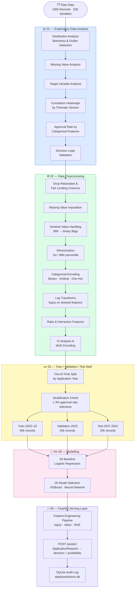
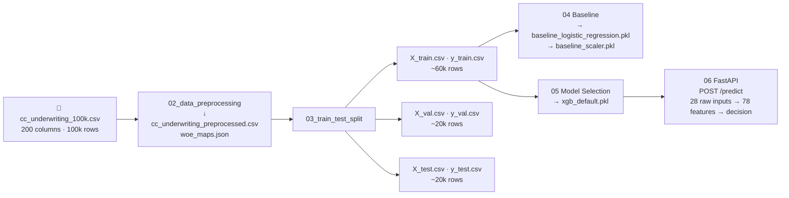

# Credit Card Underwriting — ML Pipeline

> A full end-to-end machine learning pipeline for predicting credit card application approval using 100,000 synthetic US consumer banking records across 200 variables, served via a production-ready FastAPI endpoint.


---

## Table of Contents

- [Business Problem](#business-problem)
- [Dataset](#dataset)
- [ML Pipeline](#ml-pipeline)
- [Project Structure](#project-structure)
- [Notebooks](#notebooks)
- [Data Flow](#data-flow)
- [Models](#models)
- [Train / Validation / Test Split](#train--validation--test-split)
- [Approval Decision Logic](#approval-decision-logic)
- [Fair Lending Compliance](#fair-lending-compliance)
- [FastAPI Serving Layer](#fastapi-serving-layer)
- [Authentication](#authentication)
- [Docker](#docker)
- [Installation](#installation)
- [Usage](#usage)

---

## Business Problem

**Decide whether to approve or decline a credit card application for a given applicant.**

| Target Variable | Type | Distribution |
|---|---|---|
| `target_approved` | Binary (Yes / No) | ~65% approved / ~35% declined |
| `target_credit_limit_assigned` | Discrete ($0 – $50,000) | Secondary target, out of scope |

The model must be explainable, fair-lending compliant, and robust to temporal drift across economic cycles.

---

## Dataset

| Attribute | Value |
|---|---|
| Records | 100,000 |
| Features | 200 variables across 11 thematic sections |
| Date Range | January 2020 – December 2024 |
| Geography | All 50 US States |
| FICO Score Range | 300 – 850 |
| Annual Income Range | $0 – $500,000 |
| Source | Synthetic — calibrated to US consumer credit norms |
| Seed | NumPy seed = 42 (fully reproducible) |

### Variable Sections

```
┌─────────────────────────────────────────────────────────────┐
│  Section 1   Applicant Demographics        (17 variables)   │
│  Section 2   Income & Financial Profile    (20 variables)   │
│  Section 3   Credit Bureau Profile         (30 variables)   │
│  Section 4   Banking Relationship          (15 variables)   │
│  Section 5   Application Details           (16 variables)   │
│  Section 6   Risk & Fraud Indicators       (18 variables)   │
│  Section 7   Bureau Tradeline Details      (20 variables)   │
│  Section 8   Behavioural & Lifestyle       (15 variables)   │
│  Section 9   Economic Context              ( 8 variables)   │
│  Section 10  Engineered & Model Features   (20 variables)   │
│  Section 11  Supplemental Contact/Channel  (20 variables)   │
│  ─────────────────────────────────────────────────────────  │
│  Targets     target_approved, target_credit_limit_assigned  │
└─────────────────────────────────────────────────────────────┘
```

---

## ML Pipeline



---

## Project Structure

```
credit-card-underwriting/
│
├── 📂 api/                             ← FastAPI serving layer
│   ├── main.py                         ← routes: POST /predict, GET /predictions, GET /health
│   ├── feature_engineering.py          ← log1p · encoding · derived features · WoE
│   ├── schemas.py                      ← ApplicationRequest, PredictionResponse, APIError
│   ├── models.py                       ← SQLAlchemy ORM (PredictionLog, User)
│   ├── database.py                     ← SQLite engine & session factory
│   ├── limiter.py                      ← slowapi rate limiter (10 req/min)
│   ├── auth.py                         ← registration & login routes
│   ├── security.py                     ← JWT creation/verification, password hashing
│   └── templates/
│       ├── index.html                  ← HTMX browser UI (4-tab form)
│       ├── result_fragment.html        ← HTMX decision result fragment
│       └── history_fragment.html       ← HTMX prediction history fragment
│
├── 📂 data/
│   ├── raw/                            ← original immutable source data
│   │   └── cc_underwriting_100k.csv
│   ├── processed/                      ← cleaned data, train/val/test splits
│   │   ├── cc_underwriting_preprocessed.csv
│   │   ├── X_train.csv / y_train.csv
│   │   ├── X_val.csv   / y_val.csv
│   │   └── X_test.csv  / y_test.csv
│   └── external/                       ← data dictionary PDF
│
├── 📂 models/
│   ├── xgb_default.pkl                 ← selected XGBoost model
│   ├── baseline_logistic_regression.pkl
│   ├── baseline_scaler.pkl
│   └── woe_maps.json                   ← WoE bin maps for inference
│
├── 📂 notebooks/
│   ├── 01_exploratory_data_analysis.ipynb
│   ├── 02_data_preprocessing.ipynb
│   ├── 03_train_test_split.ipynb
│   ├── 04_baseline_model.ipynb
│   ├── 05_model_selection.ipynb
│   ├── 06_fastapi_endpoint.ipynb
│   ├── 07_authentication.ipynb
│   └── 08_docker.ipynb
│
├── 📂 reports/
│   └── figures/                        ← saved charts and plots
│
├── requirements.txt
└── README.md
```

---

## Notebooks

| # | Notebook | Description |
|---|---|---|
| 01 | Exploratory Data Analysis | Distributions, missing values, outlier detection, correlation heatmaps by section, approval rate analysis, decision logic validation |
| 02 | Data Preprocessing | Fair lending drops, imputation, sentinel handling, winsorization, encoding, log transforms, ratio/interaction features, IV/WoE encoding, exports `woe_maps.json` |
| 03 | Train / Test Split | Out-of-time 60/20/20 split by application year, stratification check, X/y separation |
| 04 | Baseline Model | Logistic regression, full metric suite (KS, Gini, AUC, Lift, Calibration) |
| 05 | Model Selection | XGBoost vs Neural Network vs baseline comparison, final model selection |
| 06 | FastAPI Endpoint | Serving layer: feature engineering pipeline, `ApplicationRequest` schema, HTMX browser UI, rate limiting, SQLite audit log, end-to-end tests |
| 07 | Authentication | JWT-based auth: user registration, login, password hashing (Argon2), protected routes, token expiry |
| 08 | Docker | Containerisation: Dockerfile walkthrough, building the image, running with environment variables |

---

## Data Flow



---

## Models

### Selected Model — XGBoost

| Metric | Validation | Test (OOT 2024) |
|---|---|---|
| AUC | 0.9957 | 0.9957 |
| Gini | 0.9915 | 0.9913 |
| KS | 92.85% | 93.15% |

**Configuration:** 500 estimators · best iteration 172 (early stopping) · max depth 6 · learning rate 0.05 · subsample 0.8 · colsample_bytree 0.8 · L1 α=0.1 · L2 λ=1.0

```
Round 1:  [Tree 1] ──────────────────────────────► residuals₁
Round 2:  [Tree 1] + [Tree 2] ───────────────────► residuals₂
  ...
Round 172: Σ(0.05 × Tree_k) for k=1..172 ────────► P(approved)
```

---

### Baseline — Logistic Regression

```
Input Features (n)
       │
       ▼
  ┌─────────────────────────────────┐
  │  z = β₀ + β₁x₁ + β₂x₂ + ... │
  │  P(approved) = 1 / (1 + e⁻ᶻ) │
  └─────────────────────────────────┘
       │
       ▼
  P(approved) ∈ [0, 1]
```

**Why use it:** Industry and regulatory standard. Every coefficient maps to an explicit approval factor. Required as a benchmark for all challenger models.

---

### Model Selection Scorecard

| Metric | Logistic Regression | XGBoost | Neural Network | Winner |
|---|---|---|---|---|
| Val AUC | — | **0.9957** | — | XGBoost |
| Val Gini | — | **0.9915** | — | XGBoost |
| Val KS | — | **92.85%** | — | XGBoost |
| Interpretability | ⭐⭐⭐⭐⭐ | ⭐⭐⭐ | ⭐⭐ | LR |
| Training Speed | ⭐⭐⭐⭐⭐ | ⭐⭐⭐⭐ | ⭐⭐⭐ | LR |

---

## Train / Validation / Test Split

```
Timeline ──────────────────────────────────────────────────────────────►

  2020          2021          2022    │   2023    │   2024
  ████████████████████████████████████│███████████│████████████
        TRAIN (60%)                  │  VAL (20%)│ TEST (20%)
        ~60,000 records              │ ~20,000   │ ~20,000
                                     │           │
                               out-of-time boundary
```

**Why out-of-time?** A random split would allow the model to see future economic conditions during training (e.g. 2022 rate hikes) which inflates performance estimates. OOT testing simulates real deployment where the model always scores future applicants it has never seen.

**Why stratified?** The target is ~65/35 imbalanced. Each split is verified to be within ±3% of the overall approval rate.

---

## Approval Decision Logic

Hard rules applied in the source data generation (validated in notebook 01):

```
FICO Score < 480          ──► 🚫 Automatic Decline
Bankruptcy Count > 1      ──► 🚫 Automatic Decline
Debt-to-Income > 85%      ──► 🚫 Automatic Decline

Combined Risk Score ≥ 700 ──► ✅ High approval probability
Combined Risk Score 650–699 ► 🟡 Moderate approval probability
Combined Risk Score 600–649 ► 🟠 Lower approval probability
Combined Risk Score < 600  ──► 🔴 Very low approval probability
```

---

## Fair Lending Compliance

The following protected-class variables are **excluded from all model features** per ECOA and the Fair Housing Act:

| Column | Protected Class | Law |
|---|---|---|
| `age`, `age_group` | Age | ECOA |
| `gender` | Sex | ECOA |
| `generation` | Age proxy | ECOA |
| `marital_status` | Marital status | ECOA |
| `dependents_count` | Familial status | Fair Housing Act |
| `us_citizen_status` | National origin | ECOA |

These columns are retained in a separate fairness audit dataset for disparate impact testing.

> **Note:** This dataset is 100% synthetic. No real applicant PII is included.

---

## FastAPI Serving Layer

The trained XGBoost model is served via a FastAPI application in `api/`. Callers submit human-readable application fields — the API handles all preprocessing automatically.

### Feature Engineering Pipeline

Users provide **28 raw inputs**. The API automatically computes all 78 model features:

```
28 raw inputs
    │
    ├─► Log1p transforms        annual_income, balances, deposits → compressed scale
    ├─► Ordinal encoding        education level (string → 1–7), FICO score → tier (1–5)
    ├─► One-hot encoding        employment_status, housing_status → binary columns
    ├─► Derived features        disposable income, DTI capacity, FICO × utilization, etc.
    └─► WoE encoding            33 features → _woe variants via models/woe_maps.json
                                        │
                                78-feature dict → xgb_default.pkl → APPROVED / DECLINED
```

### Endpoints

| Method | Path | Description |
|---|---|---|
| `POST` | `/predict` | Score a credit application. Returns decision + probability. |
| `GET` | `/predictions` | Paginated prediction history (audit log). |
| `GET` | `/predictions/{id}` | Single prediction record. |
| `GET` | `/health` | Liveness check — model info and total predictions. |
| `GET` | `/error-codes` | Full error code contract. |
| `GET` | `/docs` | Swagger UI — interactive API documentation. |
| `GET` | `/` | Browser UI — tabbed HTMX form for manual scoring. |

### Rate Limits

- `POST /predict` — 10 requests / minute / IP
- `GET /predictions` — 30 requests / minute / IP

### Example Request

```bash
curl -X POST http://localhost:8000/predict \
  -H "Content-Type: application/json" \
  -d '{
    "education_level": "Bachelor Degree",
    "employment_status": "Full-Time",
    "housing_status": "Rent",
    "years_employed": 5,
    "recent_employment_change": false,
    "has_existing_mortgage": false,
    "annual_income": 75000,
    "total_household_income": 90000,
    "savings_account_balance": 15000,
    "retirement_account_balance": 25000,
    "avg_monthly_deposits": 6500,
    "avg_monthly_withdrawals": 5800,
    "payroll_direct_deposit_amount": 5500,
    "total_monthly_expenses": 3000,
    "monthly_rent_mortgage": 1500,
    "self_reported_monthly_rent": 1500,
    "fico_score": 720,
    "credit_utilization_ratio": 0.20,
    "debt_to_income_ratio": 0.30,
    "oldest_account_age_months": 84,
    "num_open_accounts": 5,
    "num_student_loans": 1,
    "student_loan_outstanding_balance": 10000,
    "mortgage_outstanding_balance": 0,
    "requested_credit_limit": 5000,
    "predicted_default_probability": 0.10,
    "employment_stability_score": 0.80,
    "income_stability_score": 0.80,
    "financial_health_score": 0.72,
    "combined_risk_score": 280
  }'
```

### Example Response

```json
{
  "id": 1,
  "decision": "APPROVED",
  "probability": 0.9998,
  "fico_score": 720.0,
  "annual_income": 75000.0,
  "debt_to_income_ratio": 0.3,
  "created_at": "2026-04-02T14:32:01Z"
}
```

### Browser UI

The browser UI at `http://localhost:8000/` provides a 4-tab form for manual scoring:

| Tab | Fields |
|---|---|
| Personal | Education, employment status, housing, years employed, flags |
| Income & Expenses | Raw dollar amounts — income, savings, deposits, expenses, rent |
| Credit Profile | FICO, utilization, DTI, account history, loan balances, requested limit |
| Risk Scores | 5 bureau/system scores (default probability, stability, financial health) |

---

## Authentication

The API uses JWT (JSON Web Token) authentication. All prediction endpoints require a valid token.

### Register a user

```bash
curl -X POST http://localhost:8000/auth/register \
  -H "Content-Type: application/json" \
  -d '{"email": "user@example.com", "password": "yourpassword"}'
```

### Login and get a token

```bash
curl -X POST http://localhost:8000/auth/token \
  -d "username=user@example.com&password=yourpassword"
```

Use the returned `access_token` in the `Authorization` header for subsequent requests:

```bash
curl -X POST http://localhost:8000/predict \
  -H "Authorization: Bearer <your-token>" \
  -H "Content-Type: application/json" \
  -d '{...}'
```

Tokens expire after 30 minutes.

---

## Docker

### Prerequisites

- [Docker Desktop](https://www.docker.com/products/docker-desktop/) installed and running
- A `SECRET_KEY` value for signing JWTs (generate one with `python3 -c "import secrets; print(secrets.token_hex(32))"`)

### Build the image

```bash
docker build -t credit-card-underwriting .
```

### Run the container

```bash
docker run -p 8000:8000 -e SECRET_KEY=your-secret-key-here credit-card-underwriting
```

To persist the SQLite database between runs, mount the `instance/` directory:

```bash
docker run -p 8000:8000 -e SECRET_KEY=your-secret-key-here \
  -v $(pwd)/instance:/app/instance credit-card-underwriting
```

The API will be available at `http://localhost:8000`.

---

## Installation

```bash
# Clone the repository
git clone <repo-url>
cd credit-card-underwritting

# Create and activate a virtual environment
python -m venv .cc_venv
source .cc_venv/bin/activate        # macOS / Linux
.cc_venv\Scripts\activate           # Windows

# Install dependencies
pip install -r requirements.txt
```

---

## Usage

### Run the notebooks (in order)

```bash
jupyter notebook notebooks/01_exploratory_data_analysis.ipynb
```

Each notebook reads from and writes to `data/processed/` and `models/`. Place the raw dataset at `data/raw/cc_underwriting_100k.csv`.

### Start the API server

```bash
uvicorn api.main:app --reload --port 8000
```

| URL | Description |
|---|---|
| `http://localhost:8000/` | Browser UI |
| `http://localhost:8000/docs` | Swagger UI |
| `http://localhost:8000/health` | Health check |
